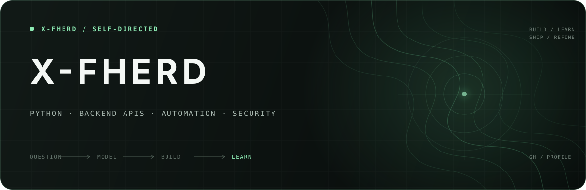

<div align="center">
  <a href="https://github.com/x-fherd">
    
  </a>
</div>

<p align="center">
  <code>SELF-DIRECTED PYTHON DEVELOPER</code>&nbsp;&nbsp;·&nbsp;&nbsp;<code>GHANA</code>
</p>

<br>

## 01 / HELLO

I'm **Ferdinand** — online as **x-fherd**.

I'm a self-directed Python developer focused on **automation**, **backend APIs**, and **cybersecurity**. I learn by building: taking an idea apart, understanding the moving pieces, and putting it back together as software that is clear, useful, and testable.

> Building systems that turn complexity into clarity.

I care about the thinking behind the code as much as the code itself — good boundaries, deliberate decisions, honest feedback, and steady improvement.

<br>

## 02 / ON THE WORKBENCH

<table>
  <tr>
    <td width="34%" valign="top">
      <sub>NOW BUILDING</sub>
      <h3>TURF</h3>
      <p><strong>T</strong>actical <strong>U</strong>nderstanding of <strong>R</strong>isk &amp; <strong>F</strong>low</p>
    </td>
    <td width="66%" valign="top">
      <sub>PROJECT NOTE</sub>
      <p>A Python-led project translating a discretionary trading process into deterministic, inspectable, and testable software.</p>
      <p><code>domain modelling</code> <code>automation</code> <code>decision systems</code> <code>testing</code></p>
    </td>
  </tr>
</table>

TURF is where I currently apply what I am learning: an execution system for expressing rules precisely, and a trade journal for turning outcomes into better decisions. It is the current build — not the boundary of what I want to become.

<br>

## 03 / HOW I BUILD

```text
question ──► understand the problem
   │
model    ──► make the rules visible
   │
build    ──► turn the model into software
   │
break    ──► test assumptions and edges
   │
learn    ──► improve the next version ─┐
   ▲                                  │
   └──────────────────────────────────┘
```

Self-directed does not mean learning alone. It means taking ownership of the path: reading deeply, experimenting deliberately, asking better questions, and finishing real things.

<br>

## 04 / WORKING SET

| Python & backend | Data & interfaces | Engineering practice |
|:--|:--|:--|
| `Python` · `REST APIs` · `Pydantic` | `SQLAlchemy` · `SQLite` · `Streamlit` | `pytest` · `Git` · `Linux` |

The list will change. The standard will not: **understand the tool, use it with intent, and leave the system clearer than I found it**.

<br>

## 05 / OPEN CHANNEL

I am open to thoughtful conversations around Python, backend development, automation, cybersecurity, and learning through ambitious projects.

<p align="center">
  <a href="https://github.com/x-fherd"><strong>EXPLORE THE WORK</strong></a>
  &nbsp;&nbsp;↗&nbsp;&nbsp;
  <a href="https://www.linkedin.com/in/x-fherdinand"><strong>CONNECT ON LINKEDIN</strong></a>
</p>

<br>

<p align="center">
  <sub>BUILD QUIETLY&nbsp;&nbsp;·&nbsp;&nbsp;TEST RELENTLESSLY&nbsp;&nbsp;·&nbsp;&nbsp;SHIP DELIBERATELY</sub>
</p>
